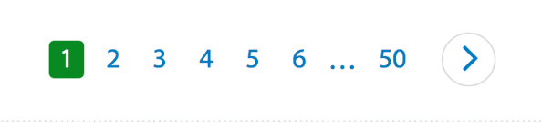
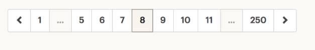

## Good Practices for Pagination
+ Pagination should be intuitive
+ Provide large clickable areas
+ Don't use underlines
+ Identify the current page
+ Space out page links
+ Provide **`Previous`** and **`Next`** links
+ Use **`First`** and **`Last`** links where applicable (use page number instead)

#### The User must know:
+ Where they are
+ Where they've been *(see below )*
+ Where they can go

(*The special styling for pages which user already visited is a useful enhancement, but can be included in **Should Have**
section of project planning*)

## Use cases
Below are different websites with their pagination. I will try to analyze each case according to good practices mentioned at the top of this document.

### Wallmart

- The current page is 1. The green background of the page link identifies which page we are on.
- The page links are spaced out.
- The last page number serves as the **`Last`** link - and also indicates how many pages total.
- There is a **`Next`** button in the shape of right arrow.

- Here we moved to page 4. 
- We now have the **`Previous`** link.
- We can also see that when we point at desired link there is a hover effect which visually helps to navigate and click on the link.

- Now we are on page 6.
- We have **`Previous`** and **`Next`** links
- We have **`First`** and **`Last`** links as first and last page numbers
- There is also hellips on each side and an offset of two links on both sides.

- Now we are on last page
- we don't have the **`Next`** link anymore
- we have only one hellip in the beginning
- The way pagination looks now limits our access to the middle pages, we have to get to the first page in order to get to the middle. 

*Summary*: This pagination for me as a user was very intuitive, easy to navigate. Didn't really like that I have to jump to the first page from the last one, to access middle pages.

### Etsy

