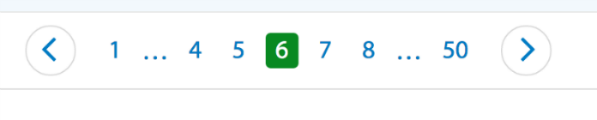

*Note*: A lot of websites use *Infinite Scrolling* instead of *Pagination*.

*Pagination* is the method of splitting up content into several pages and providing a set of links you usually see at the bottom or top of a page that allows you to go to the next or previous page, or choose a page number you want manually.

## Good Practices for Pagination
+ Pagination should be intuitive
+ Provide Reasonable Page Length
  * Safe option for search results is to display 25 to 75 items per page. However, this number is very approximate. The real number will depend on the site’s context and industry.
+ Provide large clickable elements
  * It’s simply essential to make the targets big enough so users will be able to spot and hit them faster and easier.
+ Don't use underlines
+ Identify the current page
  * “Where am I?” is one of the fundamental questions users need to answer to successfully navigate. Users rely on visual cues from navigation elements to answer this critical question. That’s why you should identify the current page clearly with a proper styling. Your users need to know where they are right now. The current page should be significantly different in style from the other pages, so that users can easily keep track of where they are. And don’t rely on color alone, ensure that the status is understandable when viewed without color!
+ Space out page links
  * You should make sure that there is enough space between each page link so that a user can’t accidentally click on the wrong page number.
+ Provide **`Previous`** and **`Next`** links
  * In order to create a decent pagination control, you should clearly separate them from the page numbers and give them sufficient distance or unique styling so that they can't be mistaken as a page.
+ Don't use **`First`** and **`Last`** links
  * Some paginations have first and last links that allow users to skip to the first or last page. Sometimes the first and last links are displayed using double arrowheads, which users can mistakenly press thinking that they’re the single arrowheads’s next and previous navigation buttons.
  * Labeling the links “first” and “last” also causes clicking errors because of its proximity to the “next” and “previous” link.
  * In most cases, the first and last links aren’t necessary because users prefer to view content in chronological order. There’s no reason for them to start from the last page unless they’re trying to find content from the past that they’ve already seen before.
  * However, there is practical value in providing the option to go back to the first page. The first page often has the most relevant and recent content. After paginating the user might want to go back to the first page without having to click the “previous” link over and over. **You should display the first page link as the number one, such as “1”.**

#### The User must know:
+ Where they are
+ Where they've been *(see below )*
+ Where they can go

(*The special styling for pages which user already visited is a useful enhancement, but can be included in **Should Have**
section of project planning*)

## Use cases
Below are different websites with their pagination. I will try to analyze each case according to good practices mentioned at the top of this document.

### Wallmart

- The current page is 1. The green background of the page link identifies which page we are on.
- Page 1 also serves as a **`First`** link.
- The page links are spaced out.
- The last page number serves as the **`Last`** link and also indicates how many pages total.
- There is a **`Next`** button in the shape of right arrow.

- Here we moved to page 4. 
- We now have the **`Previous`** link.
- We can also see that when we point at desired link there is a hover effect which visually helps to navigate and click on the link.

- Now we are on page 6.
- We have **`Previous`** and **`Next`** links
- We have first and last page numbers as **`First`** and **`Last`** links
- There are also hellips on each side and an offset of two links on both sides.

- Now we are on last page
- we don't have the **`Next`** link anymore
- we have only one hellip in the beginning
- The way pagination looks now limits our access to the middle pages, we have to get to the first page in order to get to the middle. 

*Summary*: This pagination for me as a user was very intuitive, easy to navigate. I think it is a very good idea to remove a **`Last`** link in the shape of arrow when we are on the last page. That way we do not confuse the user with unneeded options.

### Etsy

The pagination from [etsy.com](https://www.etsy.com) is similar to [wallmart.com](https://www.wallmart.com) pagination. 

On the first page:

In the middle:

Further in the middle when hellips appear:

On the last page:

*Summary*: Though it's pretty similar to the previous one it was nice and easy to click on the links due to the borders and padding they have. 
